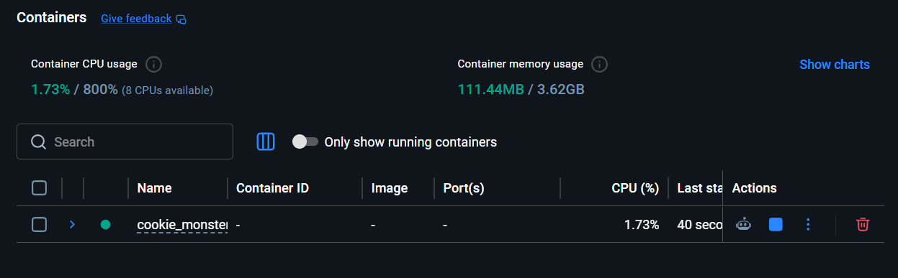

# Cookie Monster

A Firefox extension that compares what a website's privacy policy **claims** about
data collection against what the site **actually does** during a page visit.
MVP scope is limited to **cookies only**.

This is a portfolio project, not a production deployment.

## Core idea

For each site visited, the extension surfaces a four-quadrant comparison:

| | Disclosed in policy | Not disclosed |
|---|---|---|
| **Observed** | Expected behavior | 🚩 Undisclosed collection |
| **Not observed** | Policy overstates | Nothing to report |

The table shows this as raw sanitized data — no generated explanation of
what a mismatch means; the user interprets it themselves.

For the MVP, cookie-related sections of each site's privacy policy are
identified **manually** by the team (keyword/ctrl+F search) before being fed
to the OPP-115-tuned model.

## Team & ownership

| Area | Folder | Owner |
|---|---|---|
| Firefox extension + cookie capture | `extension/` | Frontend |
| OPP-115 & cookie DB preprocessing | `data-processing/` | Data scientists |
| Category filter model | `ml-models/category_filter/` | ML scientists |
| Attribute extractor model | `ml-models/attribute_extractor/` | ML scientists |
| FastAPI / Postgres / Docker | `backend/` | Backend |
| Crosswalk table + comparison logic | `crosswalk/` | Tech Lead |

## Repo layout

```
Cookie_Monster/
├── extension/            # Firefox extension (WebExtensions API, Manifest V3)
├── data-processing/      # OPP-115 preprocessing + cookie database
│   ├── policy-snippets/   # manually extracted cookie-related policy text per site
│   └── cookie-supplement.csv  # team-added lookups for cookies unrecognized by Open Cookie Database
├── ml-models/            # attribute extractor model
├── backend/              # FastAPI app, Postgres migrations, Dockerfile
├── crosswalk/            # crosswalk table + four-quadrant comparison logic
├── docs/
│   ├── ARCHITECTURE.md     # how the pieces fit together
│   └── DATA_CONTRACTS.md   # schemas passed between roles — read before coding
├── docker-compose.yml
└── .env.example
```

## Prerequisites

- **Docker Desktop** — [docker.com/products/docker-desktop](https://www.docker.com/products/docker-desktop)
  - After installing, open Docker Desktop and wait for it to say "Docker Desktop is running" before using any `docker` commands
  - Restart your terminal (or VS Code) after installing Docker Desktop so it picks up the updated PATH
  - If Docker Destktop won't run, you may need to update `wsl`
- **Git** — to clone the repo
- **A Firefox install** — for loading the extension via `about:debugging#/runtime/this-firefox`

Verify your setup with:
```bash
docker --version
docker compose version
```
Both should print a version number, not a "command not found" error.

## Getting started

1. Clone the repo and copy the env template:
   ```bash
   git clone <repo-url>
   cd Cookie_Monster
   cp .env.example .env
   ```
2. Open the Docker app and wait until the container is running. 


3. Bring up the backend + database:
   ```bash
   docker compose up --build
   ```
   FastAPI will be available at `http://localhost:8000`, Postgres at `localhost:5432`.
4. Load the extension in Firefox:
   - Go to `about:debugging#/runtime/this-firefox`
   - Click **Load Temporary Add-on** and select `extension/manifest.json`
5. **Before writing code that hands data to another role**, read
   [`docs/DATA_CONTRACTS.md`](docs/DATA_CONTRACTS.md). Schema mismatches between
   data-processing → ML → backend are the biggest integration risk on this project.

## Branching & PRs

- `main` is protected — no direct pushes, PRs require one review.
- Branch naming: `<area>/<short-description>`, e.g. `extension/cookie-capture`,
  `ml/category-filter-v1`, `crosswalk/four-quadrant-logic`.
- Use the PR template — it asks whether your change touches a data contract.

## Tech stack

- **Extension**: Firefox, WebExtensions API, Manifest V3
- **Backend**: Python, FastAPI
- **Migrations**: Alembic
- **ML**: HuggingFace Transformers
- **Database**: PostgreSQL
- **Infra**: Docker / docker-compose
