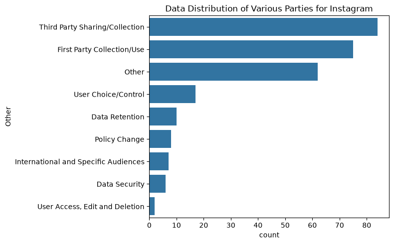
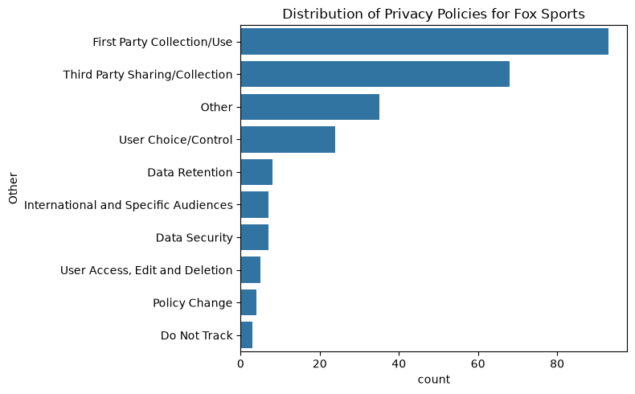
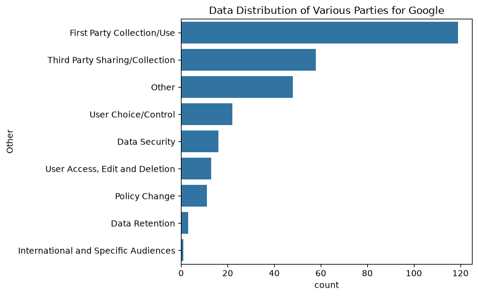

OPP-115 Initial Analysis:

9/23/26
Description of each Folder:
-*annotations/* contains CSV files that show the output of the skilled workers.
-*consolidation/* contains three subdirectories of CSV files with inter-annotator redundancies removed.
-*documentation/* contains information about the archive contents.
-*documentation/errant_span_indexes/* contains files listing IDs of data practices with erroneous indexes for text spans.
-*original_policies/* contains the privacy policies (mostly) in their raw, web-sourced form
-*pretty_print/* contains human-readable (English sentences) interpretations of the fine-grained annotations.
-*pretty_print_uniquified/* contains the human-readable results of grouping together identical privacy practices.
-*sanitized_policies/* contains the privacy policy texts in a simplified, segmented format.

Steps: 
1. Begin an analysis of some files
2. Find and analyze any relations to see if there are any positive relationships
3. Attempt to compress any necessary files to make analysis easier and find cleaner relationships

Found:
Regarding our test websites documentation has list of websites not used in OPP-115 so potentially find these websites and use them for testing?

Plan: 
Take a look at the first and third party cookies; analyze that and see what we can do with that distrubtion
Analyze and get a better understanding of the dataset and the distribution of first and third party

9/24/26
Going into more depth with plan from yesterday

Plan: Upload more visualizations and outside research done

Visualzations: 

- take note of the primary and most frequently found values
    -First and Third Party apparently have subsets to them I can potentially utilize

Takeways:
- very useful values of First vs Third Party so can be used as potential target values for ML; to achieve this still need to find a way to compress and create column headings to understand the data
- one column is the text library can be useful need to dig more into it for results